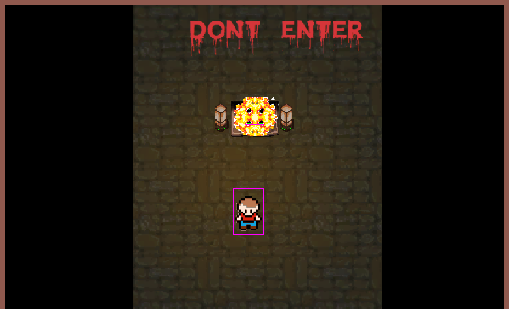

## Name:

Rpg

## Description: 

Hello! this is my first project ever for education only, where main site displays player statistic like: strength, health and expierience (alocated on server, update automatically). Player can buy some strength for experience gain from win battle (simple animate in phaser framework with randomnes damage), also the player data shared by RESTapi client write by Slim Framework. Ofcourse if earlier member will visit register form and.. REGISTER! ;).

* Map and inside house make by Tiled Map Editor
* Using simple test in phpunit mockery too checking connect with REST serwer

## Installation Windows:

1. Download XAMPP & install (version for windows) https://www.apachefriends.org/pl/index.html
2. Download zip repository
3. Create folder "rpg" in c:\\xampp\htdocs\
4. Unpack repository files and copy to creating folder
5. Go to "http://localhost/phpmyadmin/" and choose overlap "Databases"

* type: "rpg" and chose "utf8_bin",
* click create,
* click overlap "import", 
* choose file --> in root directory pick rpg_data.sql --> click Go

6. Go to "C:/xampp/apache/conf/extra/"

* open with notepad "httpd-vhosts.conf",
* paste bottom :

  <VirtualHost *:80>
     DocumentRoot "C:/xampp/htdocs"
     ServerName localhost
  </VirtualHost

  <VirtualHost *:80>
     DocumentRoot "C:/xampp/htdocs/rpg/RestAPI"
     ServerName rpg
  </VirtualHost

  # (add ">" at the end of the each line)

* save & close file,
* trun off & on xampp,
* go to http://localhost/rpg/
* click register,
* fill empty fields,
* confirm,
* click log-in,
* PLAY

## IMPORTANT!

* Enable cross-origin resource sharing in your browser and press F5 to show player data (testing in Chrome)
download: https://chrome.google.com/webstore/detail/allow-control-allow-origi/nlfbmbojpeacfghkpbjhddihlkkiljbi

## Usage:

-view on player data

- moving with arrows

- press space twice to Attack

- select radio button and click "BUY STRENGTH +5 (-5 EXP)"

- in house after enter to portal press F5 (in future its leads to next level)

Enjoy! ;)
